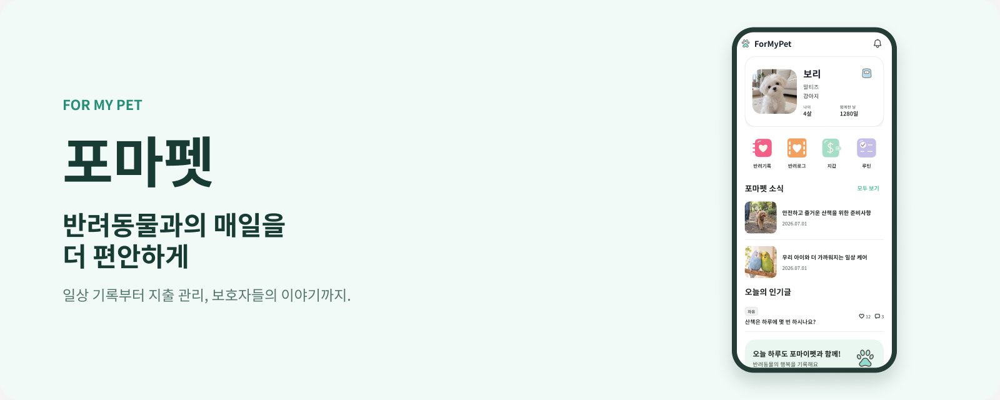

# 포마펫 (For My Pet)

반려동물과의 매일을 더 편안하게.

포마펫은 반려동물의 일상 기록, 루틴과 일정, 지출 관리, 보호자 커뮤니티를 한곳에 모은 Android 서비스입니다.

[개인정보처리방침](https://formypet-explain.netlify.app/) / [계정 삭제 안내](https://formypet-explain.netlify.app/delete-account/) / [문의](mailto:hanminyeop.dev@gmail.com)

## 서비스 현황

| 항목 | 내용 |
| --- | --- |
| 운영 시작 | 2026년 10월 |
| 제공 플랫폼 | Android |
| 앱 버전 | 1.0.0 |
| 운영 환경 | Railway / MySQL / Cloudflare R2 |
| 문서 기준일 | 2026-10-01 |

## 서비스 지표

| 지표 | 누적 수치 | 집계 기준일 |
| --- | --- | --- |
| 누적 다운로드 수 | 집계 전 | — |
| 누적 가입자 수 | 집계 전 | — |
| 등록된 반려동물 수 | 집계 전 | — |

## 주요 기능

| 기능 | 소개 |
| --- | --- |
| 반려동물 프로필 | 반려동물의 기본 정보와 사진을 등록하고 관리합니다. |
| 일상 기록 | 식사, 음수, 배변, 산책, 투약, 체중, 진료, 일기 등 반려생활을 기록합니다. |
| 루틴과 일정 | 반복되는 돌봄 루틴과 일정을 관리하고 완료 여부를 확인합니다. |
| 지출 관리 | 지출 내역을 기록하고 달력, 요약, 리포트로 확인합니다. 월 예산은 기기에 저장됩니다. |
| 커뮤니티 | 게시글, 사진, 댓글, 답글, 좋아요, 투표로 다른 보호자들과 소통합니다. |
| 계정과 고객지원 | 이메일, 카카오 로그인, 프로필 관리, 문의 접수와 회원 탈퇴를 지원합니다. |

## 앱 화면

예시 데이터를 사용한 앱 화면입니다. Figma 원본 디자인을 PNG로 내보냈습니다.

  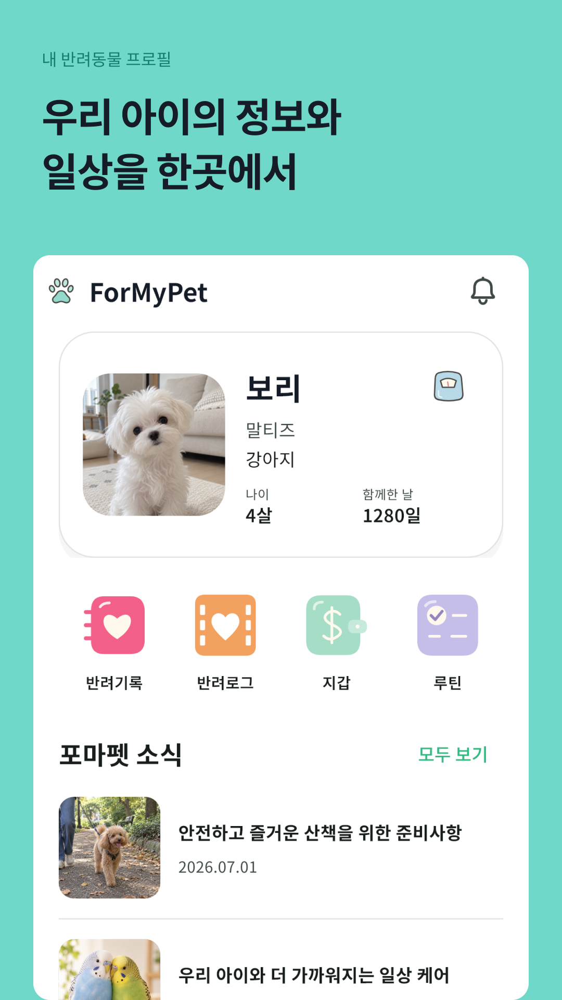
  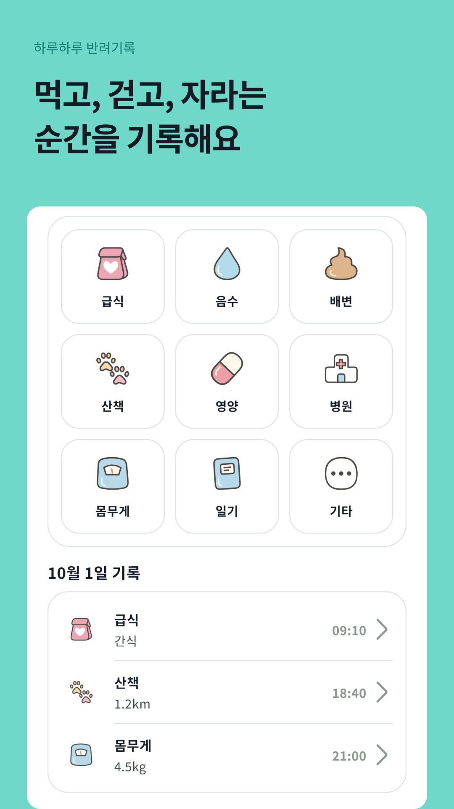
  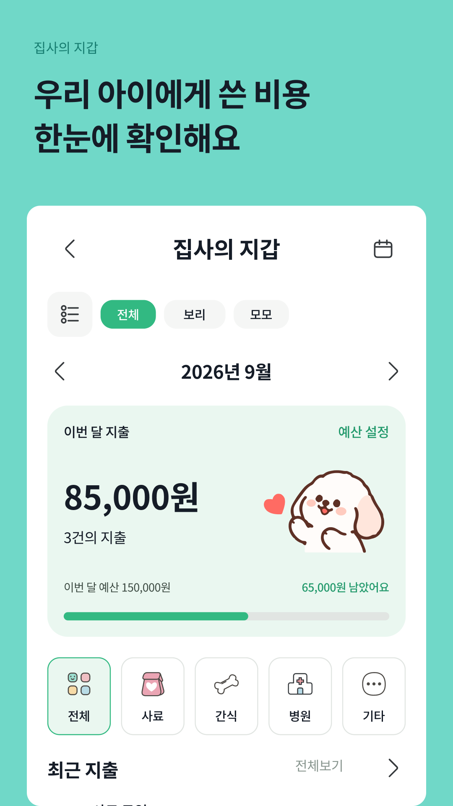

  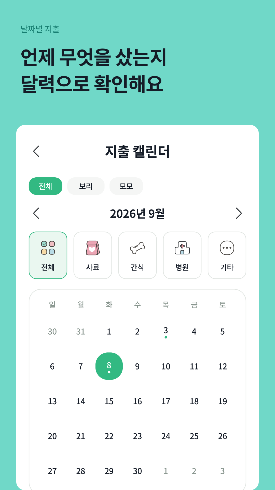
  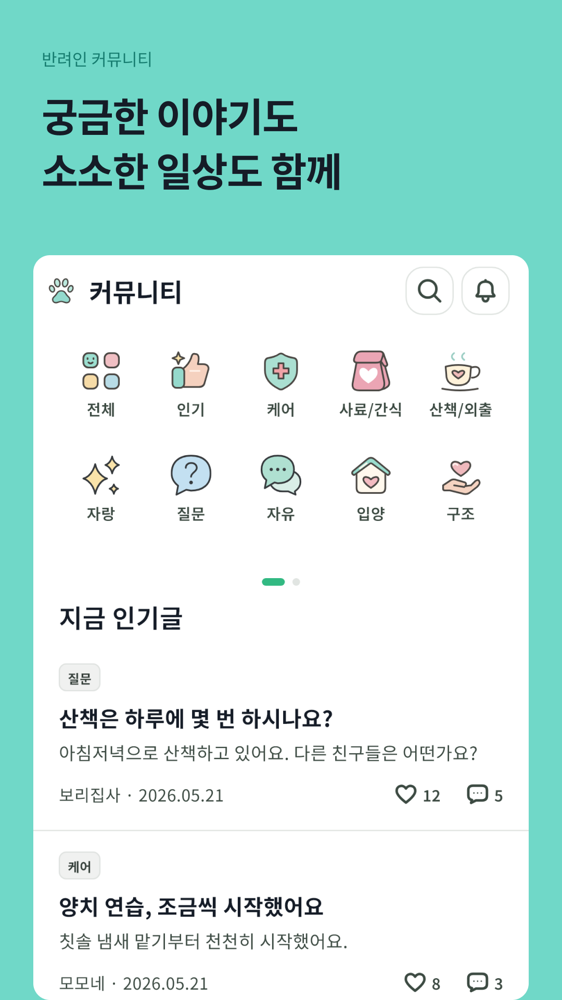

[원본 Figma 디자인](https://www.figma.com/design/MYwSnxdhmGZnLuc1pHtjZz/?node-id=1097-7)

## CI/CD 파이프라인

추가 예정

## ERD

추가 예정

## 기술 구성

### Frontend

  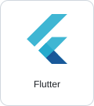
  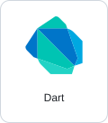

### Backend

  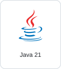
  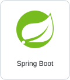
  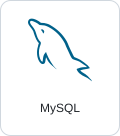
  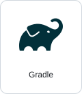

### Infrastructure

  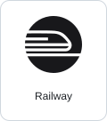
  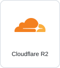
  
  
  

