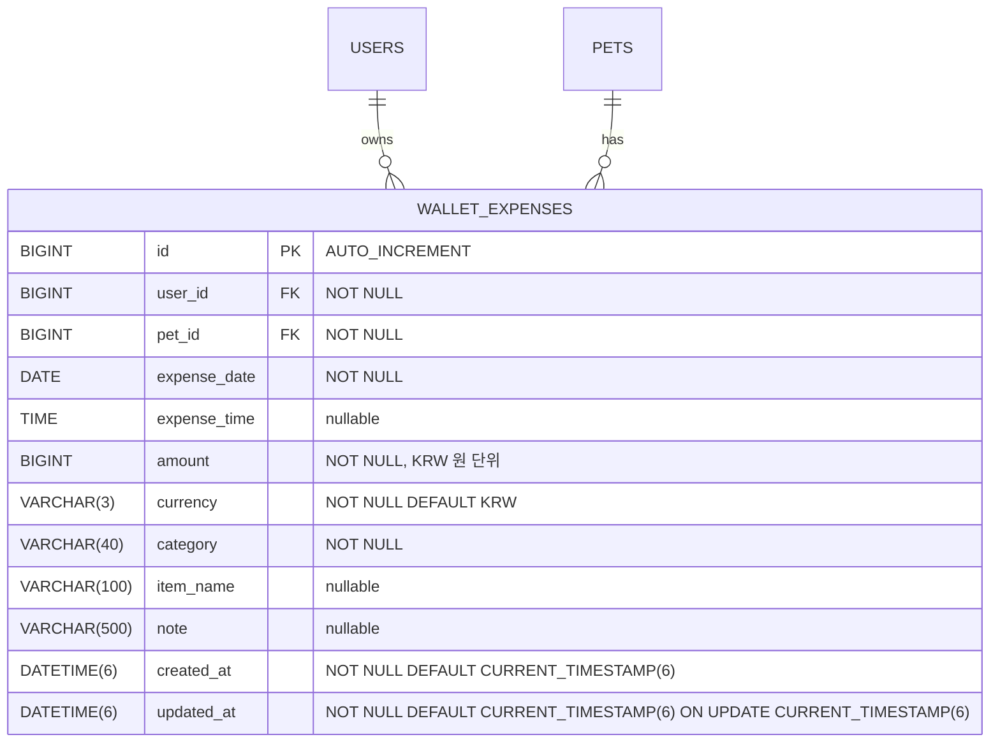

# 03. 목표 ERD

> 상태: 확정  
> 기준 문서: `02_DOMAIN_DECISIONS.md`  
> 선행 단계: `02_DOMAIN_DECISIONS.md`  
> 다음 단계: `04_API_CONTRACT.md`  
> 변경 가능 여부: 가능

## 목적

2번에서 선택한 도메인 결정에 맞춰 목표 DB 구조를 작성한다. 이번 단계의 1차 상세 대상은 지갑 도메인이며, 기존 전체 ERD는 유지하고 `wallet_expenses` 테이블만 신규 추가한다.

## 입력 문서

- `docs/BACKEND_INVENTORY.md`
- `docs/backend-roadmap/02_DOMAIN_DECISIONS.md`
- 기존 `docs/ERD.md`
- `backend/src/main/resources/db/migration/`
- `backend/src/test/resources/init-test.sql`

## 현재 스키마 기준

- 기존 `docs/ERD.md`는 참고용이다.
- 실제 현재 스키마 기준은 Flyway `V1`부터 `V15__allow_pet_birth_date_nullable.sql`까지와 `backend/src/test/resources/init-test.sql`을 우선한다.
- 기존 Flyway 파일은 수정하지 않는다. 신규 DB 변경은 5번 마이그레이션 계획에서 다음 번호의 새 파일로 추가한다.

## 전체 적용 기준

- 현재 DB와 목표 DB를 구분해서 작성한다.
- 유지 테이블, 수정 필요 테이블, 신규 테이블, 보류 테이블을 분리한다.
- 신규 테이블은 FK, index, unique, nullable 정책을 함께 정한다.
- 기존 Flyway 마이그레이션을 수정하지 않는다는 전제를 유지한다.

## 목표 ERD 변경 요약

| 구분 | 테이블 | 처리 |
|------|--------|------|
| 유지 | `users`, `oauth_accounts`, `refresh_tokens` | 기존 인증/사용자 구조 유지 |
| 유지 | `pets` | 기존 펫 구조 유지 |
| 유지 | `activity_types`, `activity_records`, `record_*` | 기존 기록 구조 유지. `expense` 타입 추가 없음 |
| 유지 | `routines`, `routine_completions` | 기존 루틴 구조 유지 |
| 유지 | `posts`, `post_likes`, `post_media`, `post_polls`, `post_poll_options`, `post_poll_votes` | 기존 커뮤니티 구조 유지 |
| 유지 | `media_resources` | 기존 미디어 구조 유지. 지갑 영수증 연결은 1차 제외 |
| 유지 | `spatial_test` | 백엔드 테스트용 테이블로 유지 |
| 신규 | `wallet_expenses` | 지갑 도메인의 반려동물별 지출 내역 저장 |
| 보류 | 일정 관련 신규 테이블 | 2번 결정에 따라 이번 ERD에서 만들지 않음 |

## 목표 관계

```text
users
  ├─ oauth_accounts
  ├─ refresh_tokens
  ├─ pets
  │   ├─ activity_records
  │   │   ├─ record_meal
  │   │   ├─ record_water
  │   │   ├─ record_medicine
  │   │   ├─ record_poop
  │   │   ├─ record_walk
  │   │   ├─ record_weight
  │   │   └─ record_vet
  │   ├─ routines
  │   ├─ routine_completions
  │   └─ wallet_expenses
  ├─ wallet_expenses
  ├─ posts
  │   ├─ post_likes
  │   ├─ post_media
  │   └─ post_polls
  │       ├─ post_poll_options
  │       └─ post_poll_votes
  └─ media_resources
```

`wallet_expenses`는 `users`와 `pets`에 직접 연결된다. `activity_records`와 `media_resources`에는 1차에서 연결하지 않는다. `users` 아래와 `pets` 아래에 모두 표시되지만, 지출 row를 중복 저장한다는 뜻이 아니다. 같은 `wallet_expenses` row를 `pet_id` 기준으로 펫별 조회하고, 스키마상 `user_id` 기준 다둥이 통합 조회로 확장할 수 있다는 뜻이다. 다둥이 통합 API는 1차 API 범위에서 확정하지 않는다.

## 신규 테이블: wallet_expenses

| 컬럼 | 타입 | 제약 | 설명 |
|------|------|------|------|
| `id` | `BIGINT` | PK, AUTO_INCREMENT | 지출 내역 식별자 |
| `user_id` | `BIGINT` | NOT NULL, FK | 소유 사용자 |
| `pet_id` | `BIGINT` | NOT NULL, FK | 지출 대상 반려동물 |
| `expense_date` | `DATE` | NOT NULL | 지출 날짜 |
| `expense_time` | `TIME` | NULL | 지출 시간. 사용자가 모르면 비울 수 있음 |
| `amount` | `BIGINT` | NOT NULL | 원 단위 정수 금액. 소수 금액은 지원하지 않음 |
| `currency` | `VARCHAR(3)` | NOT NULL, DEFAULT `KRW` | 1차는 KRW만 허용하되 금액 단위를 명확히 하기 위해 유지 |
| `category` | `VARCHAR(40)` | NOT NULL | 카테고리 문자열 코드 |
| `item_name` | `VARCHAR(100)` | NULL | 지출 항목명. 사용자가 비우면 저장하지 않음 |
| `note` | `VARCHAR(500)` | NULL | 메모 |
| `created_at` | `DATETIME(6)` | NOT NULL, DEFAULT `CURRENT_TIMESTAMP(6)` | 생성 시각 |
| `updated_at` | `DATETIME(6)` | NOT NULL, DEFAULT `CURRENT_TIMESTAMP(6)` ON UPDATE `CURRENT_TIMESTAMP(6)` | 수정 시각 |

## FK 정책

| FK | 정책 | 이유 |
|----|------|------|
| `wallet_expenses.user_id -> users.id` | `ON DELETE CASCADE` | 사용자 하드 삭제 시 지출 내역도 제거 |
| `wallet_expenses.pet_id -> pets.id` | `ON DELETE CASCADE` | 반려동물 하드 삭제 시 지출 내역도 제거 |

펫 소프트 삭제 시 `wallet_expenses`는 물리 삭제되지 않는다. 사용자 또는 펫 하드 삭제가 발생하면 FK cascade로 함께 삭제된다.

`wallet_expenses.user_id`와 `wallet_expenses.pet_id`는 각각 FK를 갖지만, DB 제약만으로는 `pet_id`가 같은 `user_id`의 반려동물인지까지 강제하지 않는다. 이 일관성은 service 계층에서 `pet_id`가 `user_id` 소유인지 검증해 보장한다. 7번 테스트 계획에서는 다른 사용자의 `pet_id`로 지출 생성/조회/수정/삭제를 시도할 때 403을 반환하는 테스트를 포함한다.

## 인덱스

| 인덱스 | 컬럼 | 목적 |
|--------|------|------|
| `idx_wallet_expenses_pet_date` | `(pet_id, expense_date, expense_time, id)` | 특정 반려동물의 날짜/시간별 지출 목록 |
| `idx_wallet_expenses_user_date` | `(user_id, expense_date, expense_time, id)` | 다둥이 통합 지출 목록과 월별 조회 |
| `idx_wallet_expenses_pet_category_date` | `(pet_id, category, expense_date, expense_time, id)` | 특정 반려동물의 기간 + 카테고리별 조회/집계 |
| `idx_wallet_expenses_user_category_date` | `(user_id, category, expense_date, expense_time, id)` | 다둥이 통합 기간 + 카테고리별 조회/집계 |

## 다둥이 통합 지출 처리

통합 지출 전용 테이블은 만들지 않는다. 모든 지출은 `wallet_expenses`에 한 번만 저장한다.

```text
펫별 조회:
WHERE user_id = ? AND pet_id = ?

통합 조회 기본값:
JOIN pets ON pets.id = wallet_expenses.pet_id
WHERE wallet_expenses.user_id = ?
  AND pets.is_deleted = false

삭제된 펫까지 포함하는 통합 조회:
WHERE user_id = ?

펫별 합산:
SUM(amount) WHERE user_id = ? AND pet_id = ?

통합 합산 기본값:
SUM(amount)
JOIN pets ON pets.id = wallet_expenses.pet_id
WHERE wallet_expenses.user_id = ?
  AND pets.is_deleted = false
```

일반 사용자 조회는 현재 활성 펫(`pets.is_deleted = false`)의 지출만 포함한다. 삭제된 펫의 지출 row는 보존하되 일반 지갑 목록, 요약, 합산에는 포함하지 않는다. 삭제된 펫까지 포함하는 조회가 필요하면 별도 관리자/백업/복구 범위에서 다시 결정한다.

펫별 지갑 API도 `pets.is_deleted = false` 검증을 먼저 통과해야 한다. 삭제된 펫의 `pet_id`로 일반 지갑 API를 호출하면 404로 처리한다. 이때 `wallet_expenses` row에 별도 soft delete flag를 전파하거나 일괄 업데이트하지 않는다.

`user_id`는 사용자별 후보 row를 빠르게 좁히기 위해 직접 저장한다. 기본 통합 조회는 활성 펫 필터 때문에 `pets` 조인이 필요하지만, `user_id` 인덱스로 먼저 사용자 범위를 줄인 뒤 조인한다. service 계층에서 `pet_id`가 `user_id` 소유인지 검증한 뒤 insert/update한다.

## Mermaid 추가분



## 도메인별 주의점

- 기록: `activity_records`에 지출을 다시 추가하지 않는다는 2번 결정과 충돌하지 않아야 한다.
- 지갑: 반려동물별 지출 저장은 `wallet_expenses`로 처리한다.
- 일정: 보류 상태면 목표 ERD에 신규 테이블로 넣지 않는다.
- 미디어: 영수증 사진은 1차 범위에서 제외한다. `media_resources`와의 연결은 2차에서 별도 결정한다.

## 명시적 제외

- `activity_records`와 `wallet_expenses`의 FK 연결 없음
- `activity_types`에 `expense` 추가 없음
- `record_expense` 테이블 없음
- `media_resources`와 `wallet_expenses`의 FK 연결 없음
- 영수증/사진 연결 테이블 없음
- summary 전용 테이블 없음
- 통합 지출 전용 테이블 없음
- 일정 신규 테이블 없음

## 이번 단계에서 결정하지 않는 것

- API endpoint
- Java 클래스명
- 테스트명
- 프론트 provider/service 구조
- 죽은 코드 삭제 범위

## 금지

- 기존 `docs/ERD.md`를 바로 전면 수정하지 않는다.
- 2번 문서에서 보류한 도메인의 테이블을 목표 ERD에 확정으로 넣지 않는다.
- 테이블명만 쓰고 FK/index/nullable 정책을 비워두지 않는다.

## 다음 단계로 넘길 수 있는 조건

- [x] 2번 문서의 도메인 결정과 충돌하지 않는다.
- [x] 신규/수정 테이블마다 FK, index, nullable 정책이 있다.
- [x] 1차 범위와 2차 범위가 분리되어 있다.
- [x] 4번 API 계약이 참조할 리소스와 필드 후보가 명확하다.
